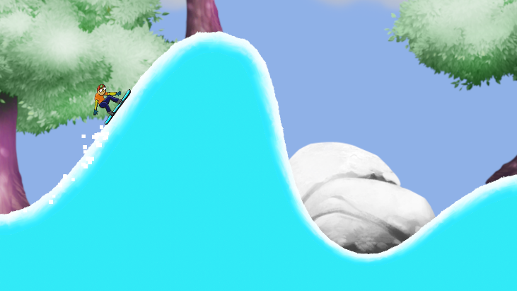

# Snow Boarder

Snow Boarder is an Unity2D game that puts you in the shoes of a snowboarder on a thrilling adventure. Ski down mountains, perform flips in the air, and aim to reach the finish post to complete the level. Be cautious, bumping your head to the ground abruptly ends your run.

## Table of Contents

- [Overview](#overview)
- [Features](#features)
- [How to Play](#how-to-play)
- [Credits](#credits)

## Overview

Snow Boarder offers an exhilarating experience as you navigate snowy mountain terrains. Enjoy performing flips, sliding effects, and immersive particle effects while trying to reach the end of the level.

## Features

- Ski down mountains and perform flips in the air.
- Particle effects on snowy and icy ground, as well as for finishing levels and bumping your head.
- SFX for finishing levels and bumping your head.
- Cool level design with trees, rocks, and clouds for immersive gameplay.

## How to Play

- **Sliding:** You will automatically slide on the ground.
- **Rotate Snowboard:** Use the left or right arrow keys to rotate your snowboard.
- **Speed Boost:** Hold the up arrow key for a speed boost.
- **Avoid Ground Collisions:** Bumping your head to the ground ends the run and restarts the game.
- **Reach Finish Post:** Aim to reach the finish post to complete the level.

## Credits

Special thanks to Rick Davidson from GameDev.tv for this project.